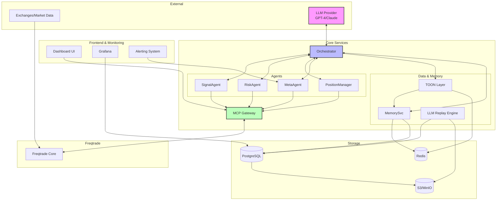
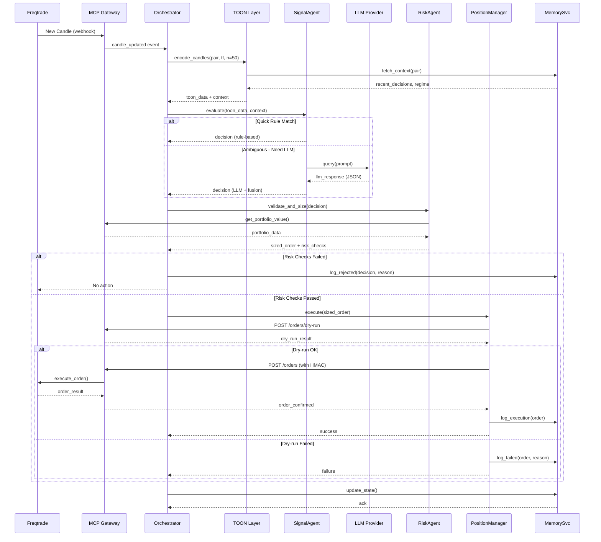
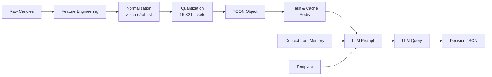
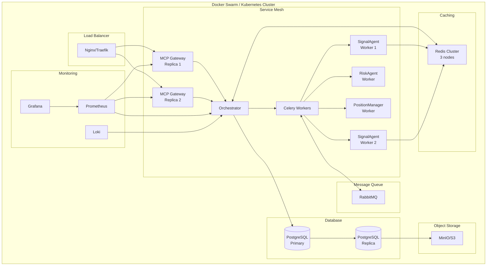
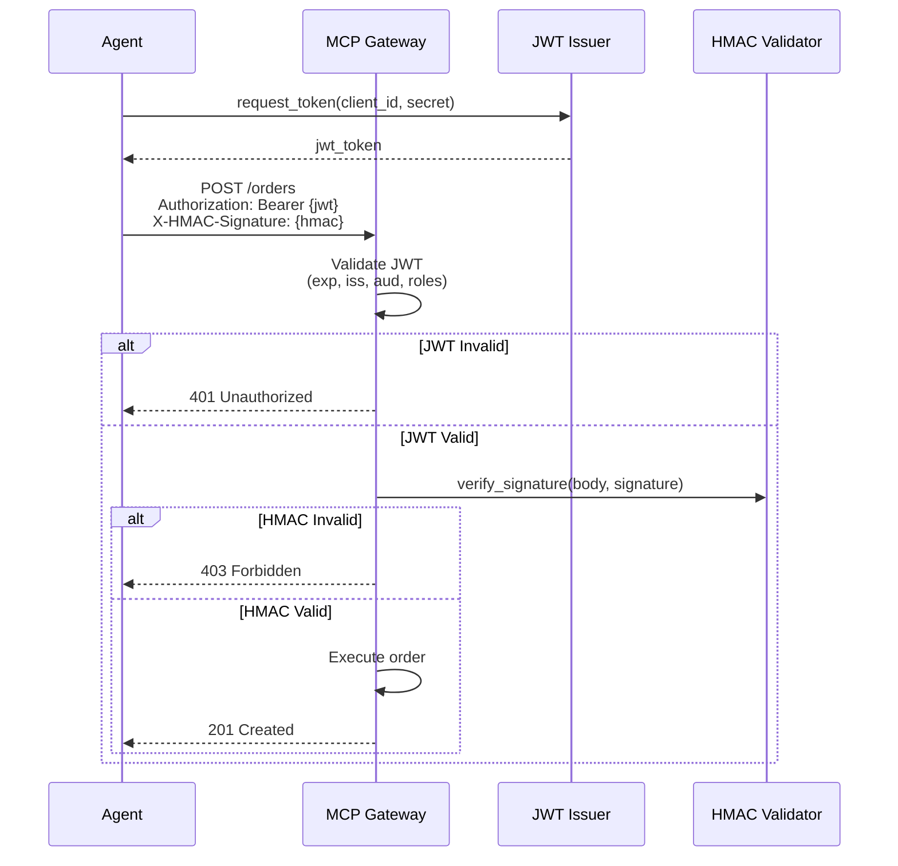
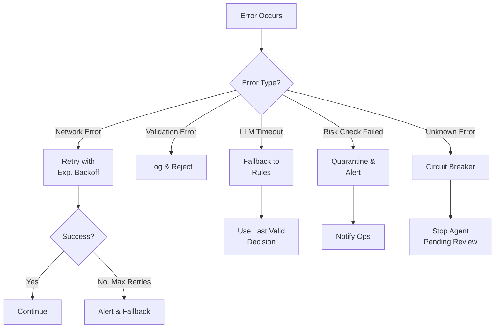

# معماری کلی — Multi-Agent Hybrid Trading Robot

هدف این سند خلاصه و تشریح معماری پیشنهادی برای ربات معاملاتی هیبریدی (Freqtrade + TOON + LLM) است. طراحی به‌گونه‌ای است که مقیاص‌پذیر، امن و قابل تست باشد.

## فهرست

1. [نمای کلی سیستم](#نمای-کلی-سیستم)
2. [اجزای کلیدی](#اجزای-کلیدی)
3. [جریان داده](#جریان-داده)
4. [نمودارهای معماری](#نمودارهای-معماری)
5. [امنیت و محدودیت‌ها](#امنیت-و-محدودیتها)
6. [مدیریت خطا و Resilience](#مدیریت-خطا-و-resilience)
7. [Scalability](#scalability)

---

## نمای کلی سیستم



## اجزای کلیدی

### 1. Orchestrator
**نقش**: هماهنگ‌کننده مرکزی و مدیریت جریان کار
- صف پیام‌ها (Message Queue) برای ارتباط بین agentها
- مدیریت نرخ تماس با LLM (rate limiting & backoff)
- زمان‌بندی اجرای agentها بر اساس رویدادها
- Load balancing بین چندین instance از هر agent

**تکنولوژی پیشنهادی**:
- FastAPI (REST API)
- Celery + RabbitMQ (task queue)
- Redis (state & cache)

### 2. MCP Gateway
**نقش**: درگاه امن برای خواندن/نوشتن وضعیت Freqtrade

**API endpoints**: [مشاهده OpenAPI Spec](./openapi.yaml)

**امنیت**:
- JWT authentication برای تمام requests
- HMAC signing برای دستورات حساس
- Rate limiting بر اساس role
- Audit logging کامل

### 3. SignalAgent
**نقش**: تولید سیگنال‌ها (hybrid: rules + LLM)

**منطق تصمیم‌گیری**:
```python
def evaluate_signal(candles, context):
    # 1. Quick heuristic check
    if quick_rules(candles):
        return {"action": "buy", "confidence": 0.6, "source": "rule"}

    # 2. TOON encoding
    toon_data = TOON.encode(candles)

    # 3. Query LLM با context
    prompt = build_prompt(toon_data, context)
    llm_response = LLM.query(prompt)

    # 4. Fusion (اگر نیاز باشد)
    final_decision = fuse_decisions([rule_output, llm_response])

    return final_decision
```

### 4. RiskAgent
**نقش**: محاسبه اندازه پوزیشن، کنترل اکسپوژر و failsafeها

**Risk Checks**:
- `max_position_size`: حداکثر اندازه هر پوزیشن
- `max_open_trades`: حداکثر تعداد معاملات همزمان
- `daily_loss_limit`: محدودیت ضرر روزانه
- `exposure_limit`: محدودیت کل اکسپوژر

**Position Sizing**:
```python
def compute_position_size(portfolio_value, volatility, risk_pct=0.02):
    # ATR-based sizing
    atr = calculate_atr(candles, period=14)
    risk_amount = portfolio_value * risk_pct
    position_size = risk_amount / (atr * 2)  # 2 ATR stop loss

    return min(position_size, max_position_size)
```

### 5. PositionManager
**نقش**: اجرای سفارش‌ها، مدیریت trailing/partial TP

**مراحل اجرا**:
1. دریافت تصمیم از SignalAgent
2. محاسبه size توسط RiskAgent
3. **Dry-run** برای بررسی risk checks
4. اجرای سفارش از طریق MCP
5. ثبت و monitoring

### 6. MemorySvc
**نقش**: حافظه کوتاه‌مدت و بلند‌مدت برای context-aware decisions

**ساختار**:
- **Short-term** (Redis): آخرین N تصمیمات، market regime، recent PnL
- **Long-term** (PostgreSQL): تاریخچه کامل معاملات، performance metrics
- **Archive** (S3): لاگ‌های قدیمی، backtest results

### 7. LLM Replay Engine
**نقش**: ضبط و بازپخش deterministic تصمیمات LLM برای backtest

[مشاهده جزئیات کامل](./replay_engine.md)

### 8. MetaAgent (اختیاری)
**نقش**: نظارت و بهینه‌سازی سیستم

- مانیتور عملکرد agentها
- تنظیم خودکار پارامترها (hyperparameter tuning)
- Trigger retrain برای surrogate models
- **Quarantine** کردن agentها در صورت رفتار نامتعارف

### 9. Monitoring & UI
**نقش**: رابط کاربری و observability

**Dashboard شامل**:
- لیست پوزیشن‌های باز
- PnL real-time
- تصمیمات اخیر با reasoning
- Performance metrics (Sharpe, Win Rate, etc.)
- System health (latency, error rate)

## جریان داده

### Sequence Diagram: اجرای یک معامله



### جریان کلی (High-level Steps)

1. **Trigger**: Freqtrade تولید یا آپدیت کندل ⇒ MCP (webhook یا poll)
2. **Encoding**: Orchestrator کندل را دریافت و به TOON Layer می‌سپارد
3. **TOON Processing**:
   - TOON خروجی را encode می‌کند
   - Context از MemorySvc دریافت می‌شود
4. **Signal Generation**: SignalAgent تصمیم اولیه را می‌گیرد
   - اگر واضح باشد: از قوانین ساده استفاده می‌شود
   - اگر مبهم باشد: پرامپت TOON به LLM ارسال می‌شود
5. **Risk Validation**: خروجی LLM (JSON) parse و توسط RiskAgent ارزیابی می‌شود
6. **Execution**: PositionManager پس از dry-run در MCP، سفارش را اجرا می‌کند
7. **Logging**: MemorySvc و لاگ‌ها به‌روزرسانی شده و UI نمایش داده می‌شود

### Data Flow Diagram: TOON Processing



## نمودارهای معماری

### Component Diagram: Deployment View



## امنیت و محدودیت‌ها

### Authentication & Authorization



### امنیت Layers

1. **Network Level**:
   - TLS 1.3 برای تمام ارتباطات external
   - mTLS برای ارتباطات inter-service
   - Network policies در Kubernetes

2. **Application Level**:
   - JWT authentication (HS256/RS256)
   - HMAC-SHA256 signing برای دستورات حساس
   - Rate limiting (Token Bucket algorithm)
   - Input validation & sanitization

3. **Data Level**:
   - Encryption at rest (PostgreSQL + S3)
   - Secrets management (Vault/AWS Secrets Manager)
   - PII data masking در logs

4. **Operational Level**:
   - Audit logging کامل (تمام APIها)
   - Intrusion detection (fail2ban)
   - Regular security scans (Trivy, Snyk)

### محدودیت‌ها و Safeguards

| محدودیت | مقدار پیش‌فرض | قابل تنظیم |
|---------|---------------|------------|
| max_position_size | 10% of portfolio | ✅ |
| max_open_trades | 5 | ✅ |
| daily_loss_limit | 5% of portfolio | ✅ |
| exposure_limit | 50% of portfolio | ✅ |
| llm_calls_per_minute | 60 | ✅ |
| max_slippage_pct | 1% | ✅ |

## مدیریت خطا و Resilience

### Error Handling Strategy



### Circuit Breaker Pattern

```python
class CircuitBreaker:
    """
    States: CLOSED (normal) -> OPEN (failing) -> HALF_OPEN (testing)
    """
    def __init__(self, failure_threshold=5, timeout=60):
        self.failure_count = 0
        self.failure_threshold = failure_threshold
        self.timeout = timeout  # seconds
        self.state = "CLOSED"
        self.last_failure_time = None

    def call(self, func, *args, **kwargs):
        if self.state == "OPEN":
            if time.time() - self.last_failure_time > self.timeout:
                self.state = "HALF_OPEN"
            else:
                raise CircuitBreakerOpenError()

        try:
            result = func(*args, **kwargs)
            if self.state == "HALF_OPEN":
                self.state = "CLOSED"
                self.failure_count = 0
            return result
        except Exception as e:
            self.failure_count += 1
            self.last_failure_time = time.time()
            if self.failure_count >= self.failure_threshold:
                self.state = "OPEN"
                alert_ops("Circuit breaker opened", str(e))
            raise
```

### Retry Strategy

- **Network errors**: Exponential backoff (2s, 4s, 8s, 16s, 32s)
- **LLM timeouts**: 3 retries با timeout 30s
- **Database errors**: 2 retries سریع (100ms, 500ms)
- **Exchange API errors**: Rate-limit aware retry

## Scalability

### Horizontal Scaling

**Stateless Services** (می‌توانند به راحتی scale شوند):
- MCP Gateway: Load balanced با Nginx/Traefik
- SignalAgent workers: Celery autoscaling
- RiskAgent workers: Celery autoscaling

**Stateful Services** (نیاز به coordination):
- Redis: Cluster mode (3-6 nodes)
- PostgreSQL: Primary-Replica + connection pooling (PgBouncer)
- RabbitMQ: Clustered با mirrored queues

### Vertical Scaling Guidelines

| Service | CPU | RAM | Notes |
|---------|-----|-----|-------|
| MCP Gateway | 2-4 cores | 2-4 GB | I/O bound |
| Orchestrator | 4-8 cores | 8-16 GB | CPU bound |
| SignalAgent | 2-4 cores | 4-8 GB | LLM calls |
| TOON Layer | 4 cores | 8 GB | NumPy/Pandas |
| Redis | 2 cores | 4-8 GB | Memory bound |
| PostgreSQL | 4-8 cores | 16-32 GB | Disk I/O |

### Performance Targets

| Metric | Target | Measurement |
|--------|--------|-------------|
| MCP API Latency (p95) | < 200ms | Prometheus |
| Signal Generation Time | < 5s | Custom metrics |
| Order Execution Time | < 1s | Audit logs |
| LLM Query Time (p95) | < 10s | OpenTelemetry |
| System Uptime | > 99.5% | Statuspage |

## نکات عملی پیاده‌سازی

1. **Containerization**:
   - هر Agent یک Docker image مستقل
   - Multi-stage builds برای کاهش حجم
   - Health checks برای هر container

2. **Logging**:
   - Structured logging (JSON format)
   - تمام تصمیمات با `request_id` یکتا
   - Log levels: DEBUG, INFO, WARNING, ERROR, CRITICAL

3. **Monitoring**:
   - Prometheus metrics برای تمام services
   - Grafana dashboards برای visualization
   - Alerting rules در Prometheus/Alertmanager

4. **CI/CD**:
   - GitHub Actions برای automated testing
   - Semantic versioning برای releases
   - Blue-green deployment برای zero-downtime

5. **Documentation**:
   - OpenAPI spec برای تمام APIs
   - Architecture Decision Records (ADRs)
   - Runbooks برای incident response
